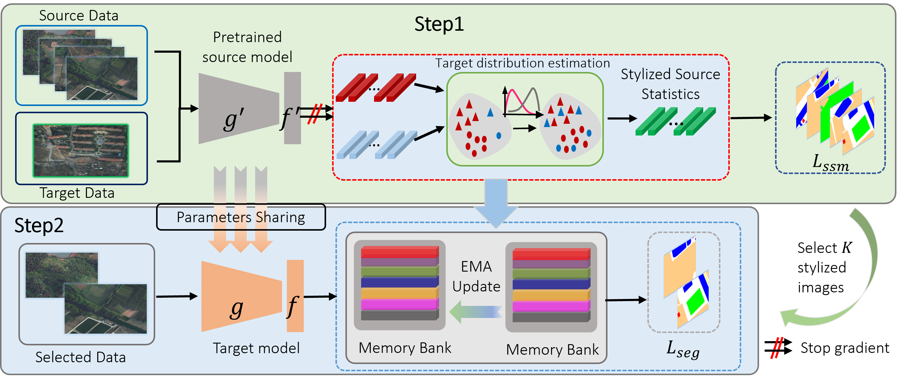

---

<div align="center">    
 
# Minimax One-shot Adaptation for Cross-Domain Semantic Segmentation in Remote Sensing Images

[Jiaojiao Tan], [Haiwei Zhang], [Ning Yao], [Qiang Yu]

<!-- /TOC -->

<div align="left">

## Architecture 

In this work, we propose **MOAT**, a novel one-shot domain adaptation framework for semantic segmentation in remote sensing images. The proposed method alternately maximizes the cross-entropy to select the most informative source samples and minimizes the cross-entropy of obtained samples to make the model fit the target data. The selected source samples can effectively describe the target data distribution using the proposed uncertainty-based distribution estimation technique. Extensive experiments have demonstrate that the prpoposed MOAT boosts the performance of one-shot domain adaptation tasks.




<div align="right">
<b><a href="#architecture">↥</a></b>
</div>

## Installation

This code is implemented with `Python 3.8.5` and `PyTorch 1.7.1` on `CUDA 11.0`.

### Download Datasets

- **GTAV:** Download all zipped images, along with their zipped labels, from [here](https://download.visinf.tu-darmstadt.de/data/from_games/) and extract them to a custom directory.
- **Cityscapes:** Download leftImg8bit_trainvaltest.zip and gtFine_trainvaltest.zip from [here](https://www.cityscapes-dataset.com/downloads/) and extract them to a custom directory.

### Setup Datasets

Symlink the required datasets:

```bash
ln -s /path/to/gta5/dataset data/gta
ln -s /path/to/cityscapes/dataset data/cityscapes
```

## Training

sh scripts/train_UDA.sh

## Acknowledgments

This project is based on the following open-source projects. We thank their authors for making the source code publicly available.


- [MaxSquareLoss](https://github.com/ZJULearning/MaxSquareLoss)
- [UDAclustering](https://github.com/LTTM/UDAclustering)
- [SM-PPM](https://github.com/W-zx-Y/SM-PPM)


<div align="right">
<b><a href="#overview">↥</a></b>
</div>

